# NitroBridge Vault - Technical Architecture

> Deep technical documentation for the NitroBridge Vault system

## Deployed Infrastructure

| Component | Address | Network | Block |
|-----------|---------|---------|-------|
| **ArcCreditTerminal** | `0xd1835d13A9694F0E9329FfDE9b18936CE872aae5` | Arc Testnet | 25322657 |
| USDC Token | `0x3600000000000000000000000000000000000000` | Arc Testnet | Native |
| TokenMessenger | `0xb43db544E2c27092c107639Ad201b3dEfAbcF192` | Arc Testnet | Circle |
| MessageTransmitter | `0x8FE6B999Dc680CcFDD5Bf7EB0974218be2542DAA` | Arc Testnet | Circle |

## System Architecture

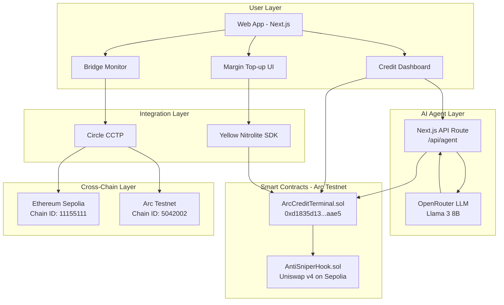

## End-to-End Flow (Actual Implementation)

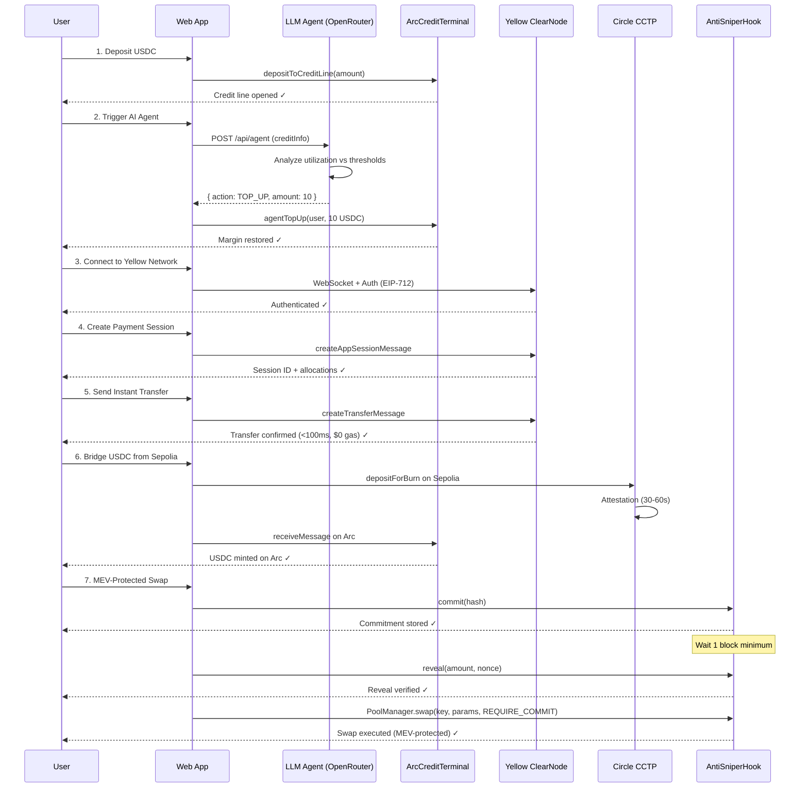

## Component Architecture

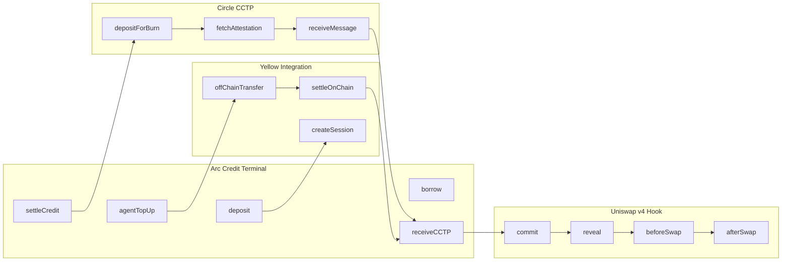

## Data Flow

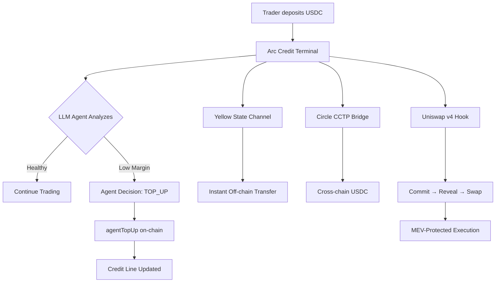

## Technology Stack

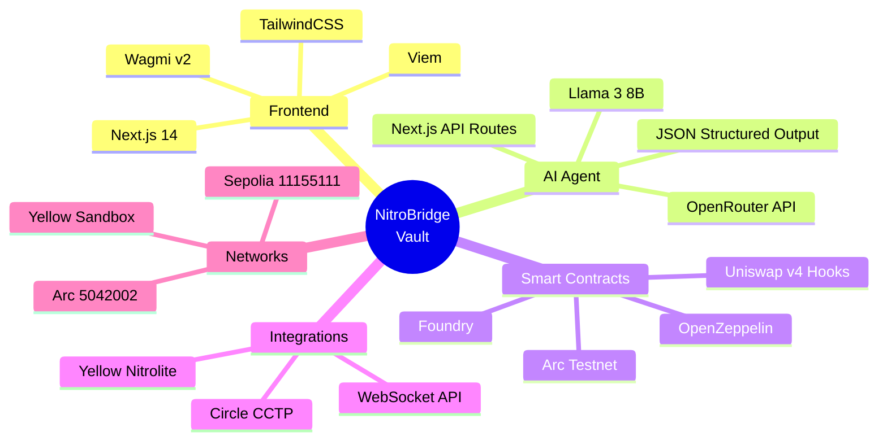

## Deployment Architecture

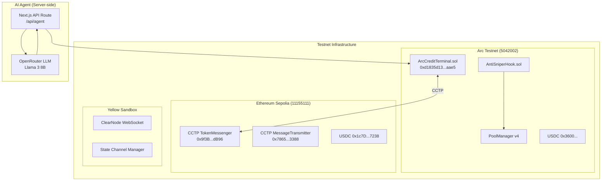

## Smart Contract Details

### ArcCreditTerminal.sol

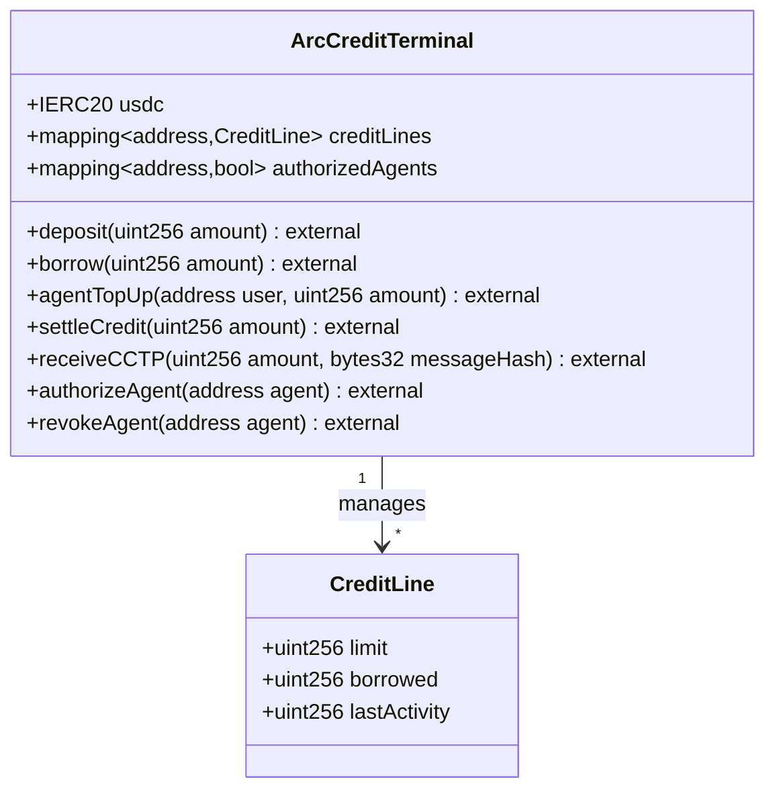

### AntiSniperHook.sol

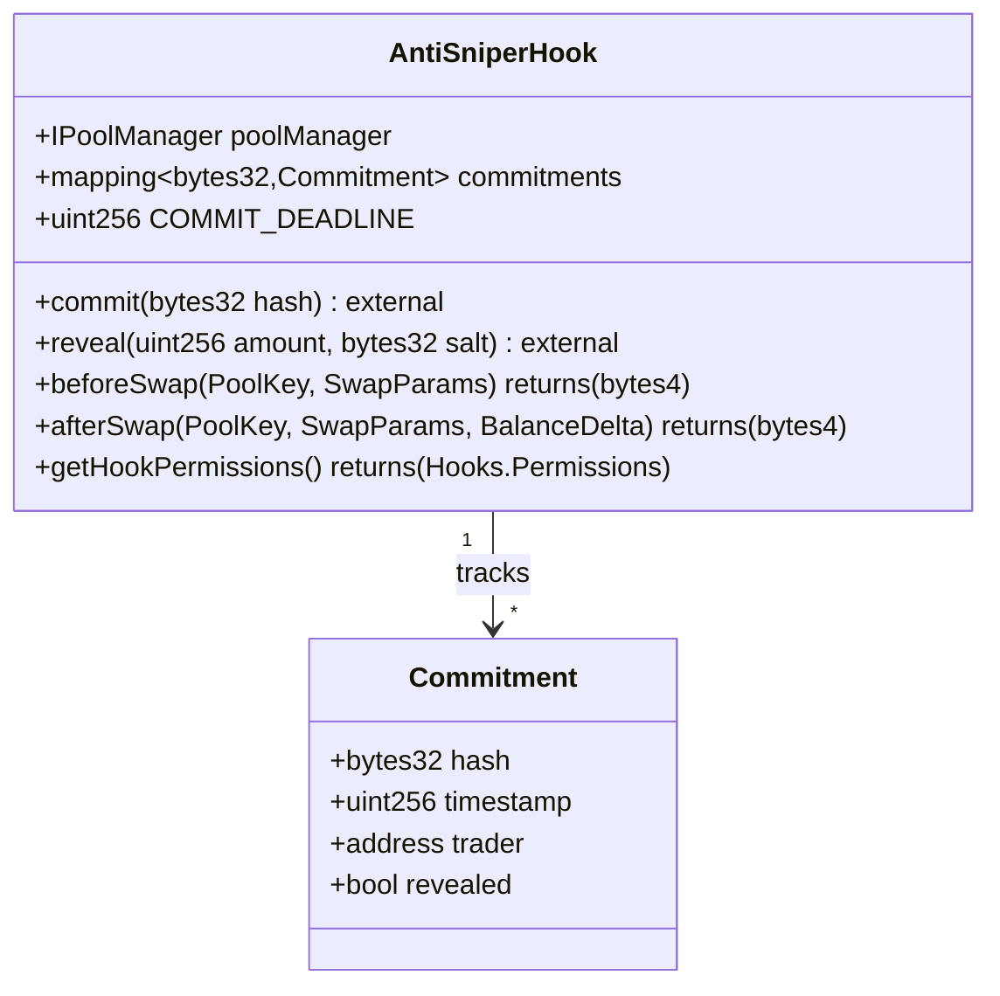

## Yellow Nitrolite Integration

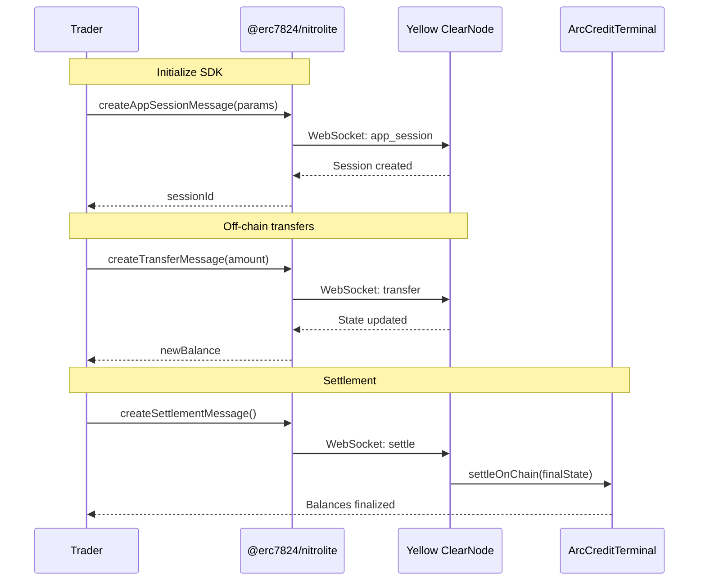

## Circle CCTP Integration

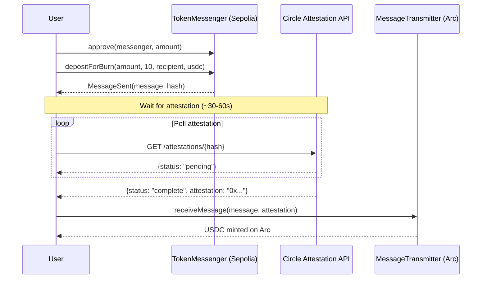

## Security Model

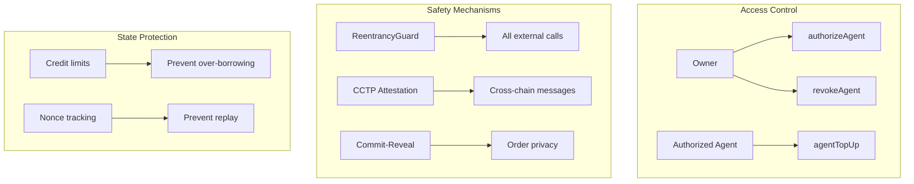

## API Reference

### LLM Agent API

| Endpoint | Method | Description |
|----------|--------|-------------|
| `/api/agent` | POST | Analyzes credit utilization and returns action decision |

**Request Body:**
```json
{
  "userAddress": "0x...",
  "creditInfo": {
    "deposited": "10000000",
    "borrowed": "7000000",
    "creditLimit": "10000000",
    "available": "3000000"
  }
}
```

**Response:**
```json
{
  "action": "TOP_UP",
  "reason": "Utilization is 70%, exceeding safety threshold.",
  "amount": "100"
}
```

**LLM Provider:** [OpenRouter](https://openrouter.ai) → `meta-llama/llama-3-8b-instruct:free`

**Fallback:** If no `OPENROUTER_API_KEY` is set, the agent uses a rule-based fallback (>50% utilization = TOP_UP).

### Environment Variables

| Variable | Required | Description |
|----------|----------|-------------|
| `OPENROUTER_API_KEY` | No* | OpenRouter API key for LLM agent |
| `NEXT_PUBLIC_WALLETCONNECT_PROJECT_ID` | Yes | WalletConnect project ID |

*Agent works with rule-based fallback if no key is provided.

### Contract ABIs

All ABIs are embedded in `frontend/lib/contracts.ts` for zero-config deployment.

