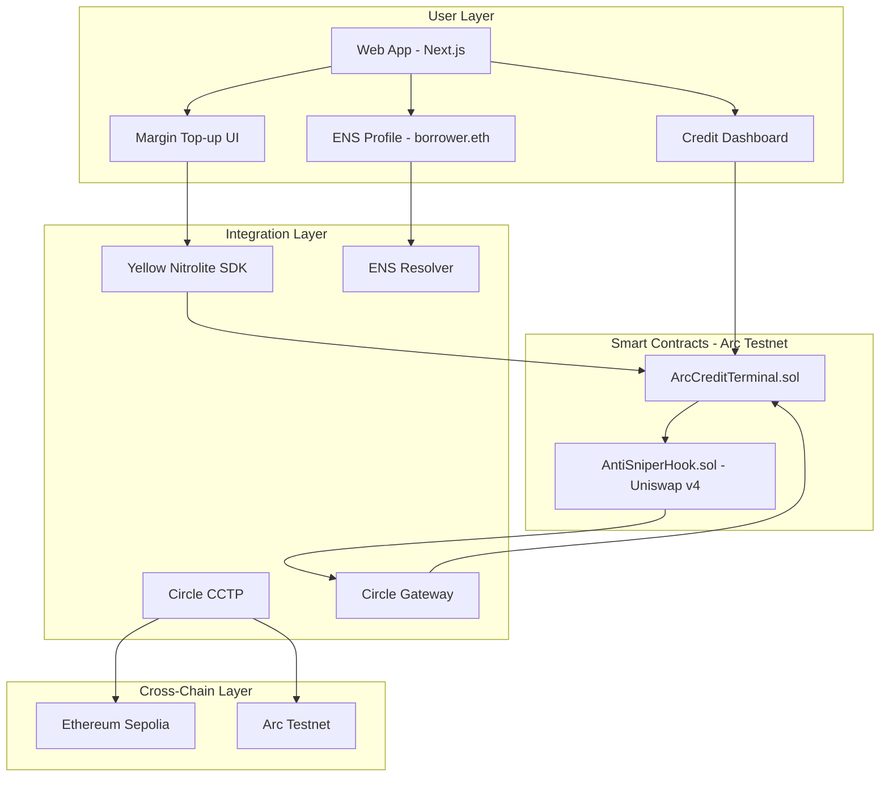
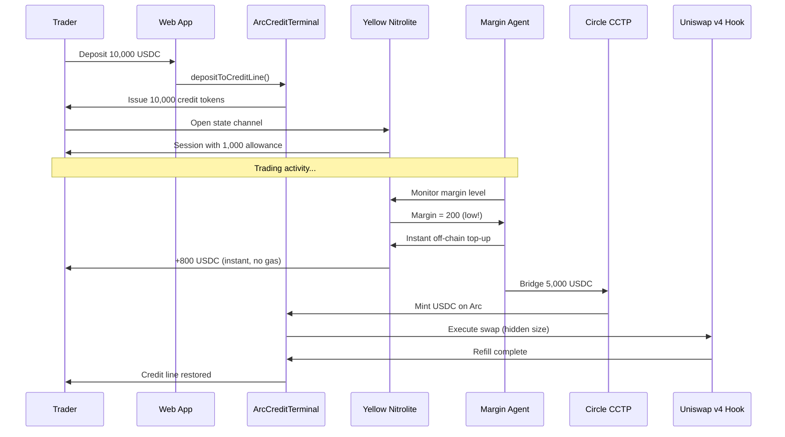
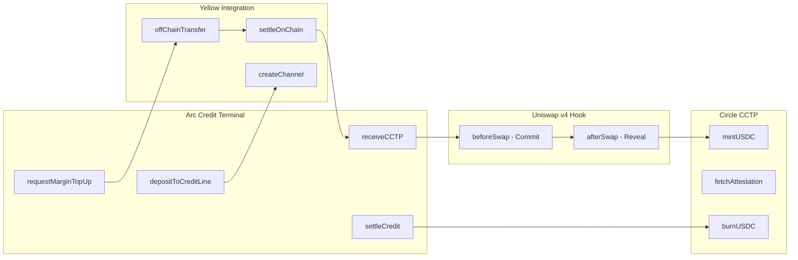
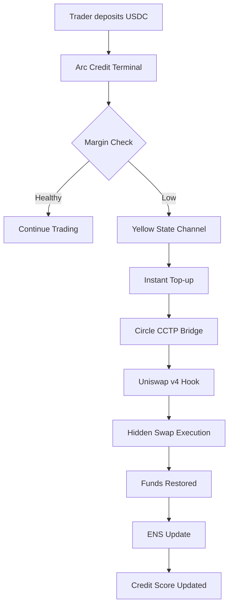
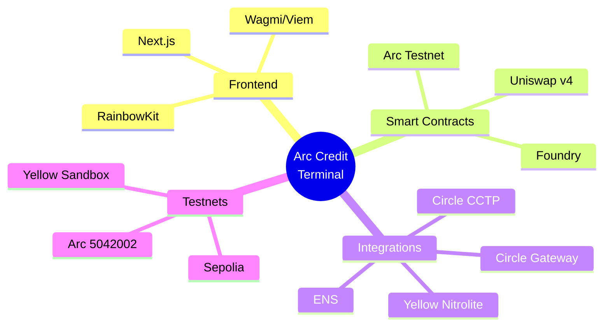
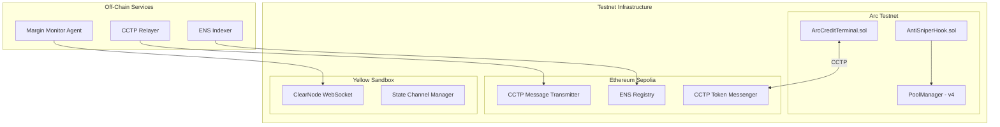

# Arc Credit Terminal - Architecture

## System Architecture

```mermaid
graph TB
    subgraph "User Layer"
        UI[Web App - Next.js]
        CD[Credit Dashboard]
        MT[Margin Top-up UI]
        EP[ENS Profile - borrower.eth]
    end

    subgraph "Smart Contracts - Arc Testnet"
        ACT[ArcCreditTerminal.sol]
        ASH[AntiSniperHook.sol - Uniswap v4]
    end

    subgraph "Integration Layer"
        YN[Yellow Nitrolite SDK]
        CC[Circle CCTP]
        CG[Circle Gateway]
        EN[ENS Resolver]
    end

    subgraph "Cross-Chain Layer"
        ES[Ethereum Sepolia]
        AT[Arc Testnet]
    end

    UI --> CD
    UI --> MT
    UI --> EP
    CD --> ACT
    MT --> YN
    EP --> EN
    YN --> ACT
    CC --> ES
    CC --> AT
    CG --> ACT
    ACT --> ASH
    ASH --> CG
```

## End-to-End Flow

```mermaid
sequenceDiagram
    participant Trader
    participant UI as Web App
    participant ACT as ArcCreditTerminal
    participant YN as Yellow Nitrolite
    participant Agent as Margin Agent
    participant CCTP as Circle CCTP
    participant US as Uniswap v4 Hook

    Trader->>UI: Deposit 10,000 USDC
    UI->>ACT: depositToCreditLine()
    ACT->>Trader: Issue 10,000 credit tokens
    
    Trader->>YN: Open state channel
    YN->>Trader: Session with 1,000 allowance
    
    Note over Trader,Agent: Trading activity...
    
    Agent->>YN: Monitor margin level
    YN->>Agent: Margin = 200 (low!)
    
    Agent->>YN: Instant off-chain top-up
    YN->>Trader: +800 USDC (instant, no gas)
    
    Agent->>CCTP: Bridge 5,000 USDC
    CCTP->>ACT: Mint USDC on Arc
    
    ACT->>US: Execute swap (hidden size)
    US->>ACT: Refill complete
    
    ACT->>Trader: Credit line restored
```

## Component Architecture

```mermaid
graph LR
    subgraph "Arc Credit Terminal"
        A[depositToCreditLine]
        B[requestMarginTopUp]
        C[receiveCCTP]
        D[settleCredit]
    end

    subgraph "Yellow Integration"
        E[createChannel]
        F[offChainTransfer]
        G[settleOnChain]
    end

    subgraph "Uniswap v4 Hook"
        H[beforeSwap - Commit]
        I[afterSwap - Reveal]
    end

    subgraph "Circle CCTP"
        J[burnUSDC]
        K[fetchAttestation]
        L[mintUSDC]
    end

    A --> E
    B --> F
    F --> G
    G --> C
    C --> H
    H --> I
    I --> L
    D --> J
```

## Data Flow

```mermaid
flowchart TD
    A[Trader deposits USDC] --> B[Arc Credit Terminal]
    B --> C{Margin Check}
    C -->|Healthy| D[Continue Trading]
    C -->|Low| E[Yellow State Channel]
    E --> F[Instant Top-up]
    F --> G[Circle CCTP Bridge]
    G --> H[Uniswap v4 Hook]
    H --> I[Hidden Swap Execution]
    I --> J[Funds Restored]
    J --> K[ENS Update]
    K --> L[Credit Score Updated]
```

## Technology Stack

```mermaid
mindmap
  root((Arc Credit<br/>Terminal))
    Frontend
      Next.js
      Wagmi/Viem
      RainbowKit
    Smart Contracts
      Arc Testnet
      Uniswap v4
      Foundry
    Integrations
      Yellow Nitrolite
      Circle CCTP
      Circle Gateway
      ENS
    Testnets
      Arc 5042002
      Sepolia
      Yellow Sandbox
```

## Deployment Architecture

```mermaid
graph TB
    subgraph "Testnet Infrastructure"
        subgraph "Arc Testnet"
            A1[ArcCreditTerminal.sol]
            A2[AntiSniperHook.sol]
            A3[PoolManager - v4]
        end

        subgraph "Ethereum Sepolia"
            S1[CCTP Token Messenger]
            S2[CCTP Message Transmitter]
            S3[ENS Registry]
        end

        subgraph "Yellow Sandbox"
            Y1[ClearNode WebSocket]
            Y2[State Channel Manager]
        end
    end

    subgraph "Off-Chain Services"
        B1[Margin Monitor Agent]
        B2[CCTP Relayer]
        B3[ENS Indexer]
    end

    A1 <-->|CCTP| S1
    A2 --> A3
    B1 --> Y1
    B2 --> S2
    B3 --> S3
```

