# NitroBridge Vault — Technical Architecture

> Deep technical documentation. No separate backend — everything runs inside a single Next.js deployment.

## Design Principle

All blockchain interactions (reads, writes, WebSocket state channels) originate from React components via wagmi/viem in the browser. The only server-side code is a single Next.js API route (`/api/agent`) that proxies an LLM call. The `backend/` directory contains standalone reference scripts that are **not used** by the running application.

## System Architecture

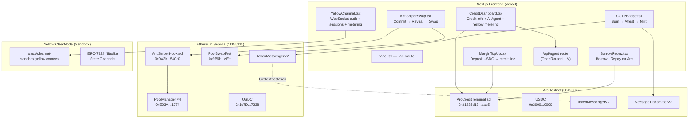

## Deployed Contracts

| Contract | Network | Address | Tx |
|----------|---------|---------|-----|
| **ArcCreditTerminal** | Arc Testnet | `0xd1835d13A9694F0E9329FfDE9b18936CE872aae5` | [Deploy](https://testnet.arcscan.app/tx/0xf30bfc37a23013a8f68d2b5375f5f5b19ddc5934b889923d91ba91462b61970f) |
| **AntiSniperHook** | Eth Sepolia | `0x0A3b821941789AC5Ff334AB6C374bb23C98540c0` | [Deploy](https://sepolia.etherscan.io/tx/0x3f495bb7d3b34ae58d1165bd1941083455afa28e89313463e13a10479247cebd) |
| ETH/USDC Pool (v4) | Eth Sepolia | `0x825ea1...63e5` | [Init](https://sepolia.etherscan.io/tx/0x77e97d786e38e1665c5cce44a8c3b24daffe953069d4497042f36ce1e4c182a3) |
| PoolManager v4 | Eth Sepolia | `0xE03A1074c86CFeDd5C142C4F04F1a1536e203543` | Uniswap |
| PoolSwapTest | Eth Sepolia | `0x9B6b46e2c869aa39918Db7f52f5557FE577B6eEe` | Uniswap |
| USDC | Arc Testnet | `0x3600000000000000000000000000000000000000` | Native |
| TokenMessengerV2 | Eth Sepolia | `0x8FE6B999Dc680CcFDD5Bf7EB0974218be2542DAA` | Circle |
| TokenMessengerV2 | Arc Testnet | `0xb43db544E2c27092c107639Ad201b3dEfAbcF192` | Circle |
| MessageTransmitterV2 | Arc Testnet | `0xE737e5cEBEEBa77EFE34D4aa090756590b1CE275` | Circle |

## End-to-End Flow

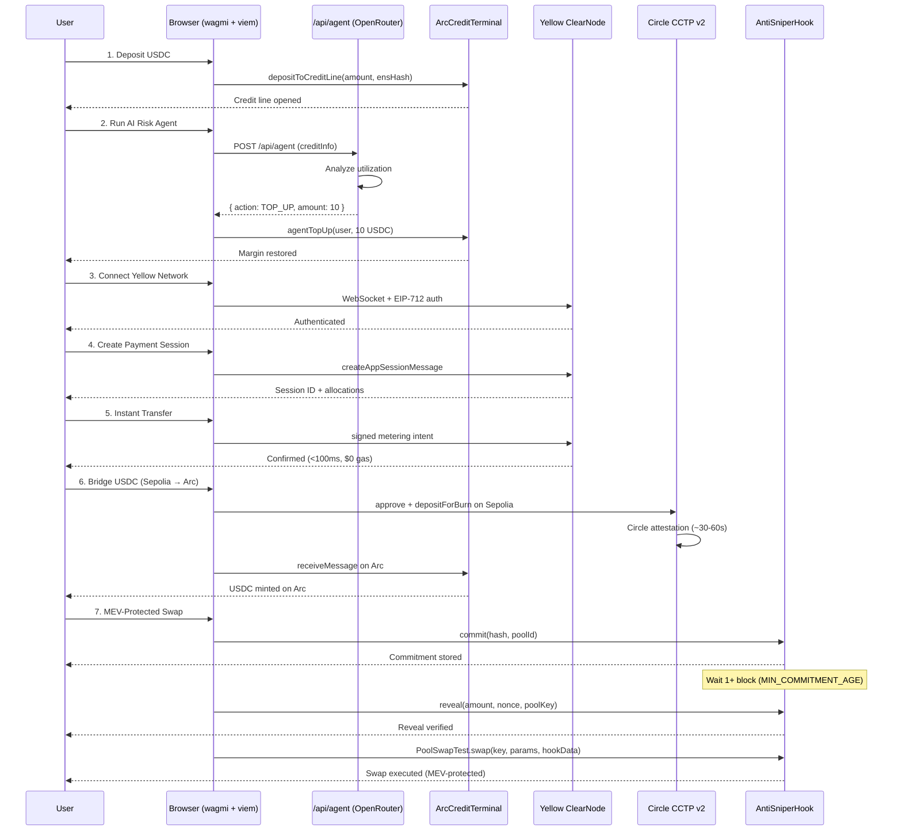

## Smart Contract Details

### ArcCreditTerminal.sol

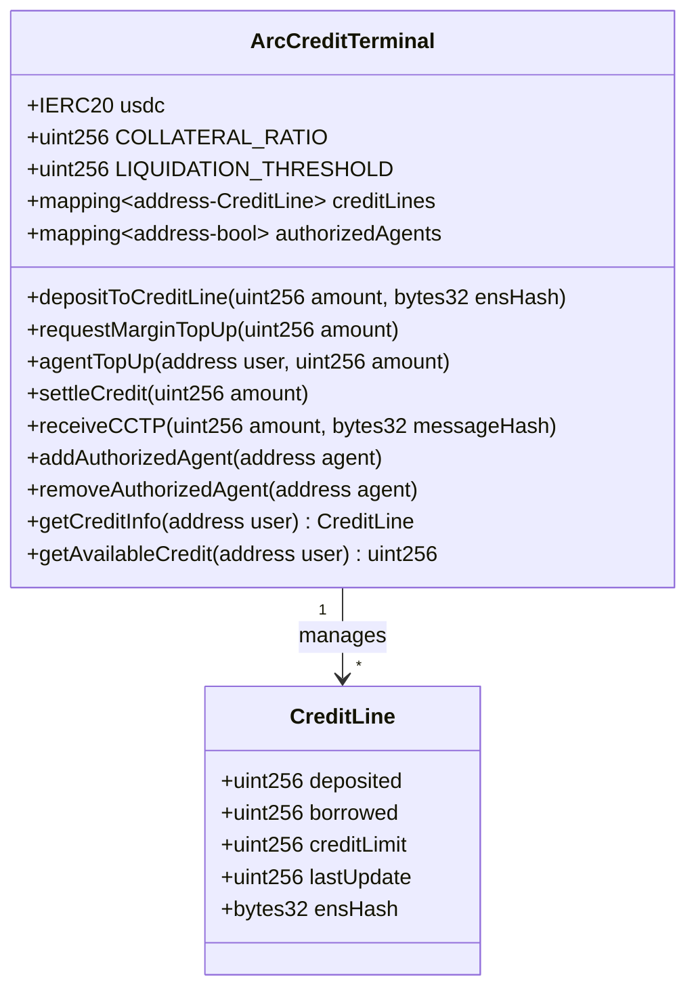

**Inherits:** OpenZeppelin `ReentrancyGuard`, `Ownable`

### AntiSniperHook.sol

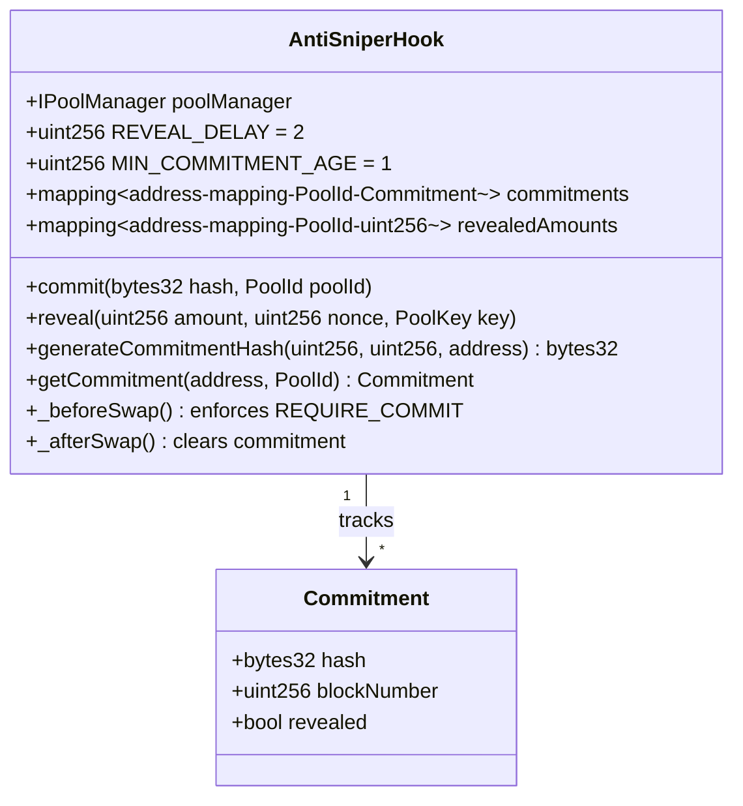

**Inherits:** Uniswap v4 `BaseHook`
**Hook permissions:** `beforeSwap: true`, `afterSwap: true` (all others false)

## Frontend Component Map

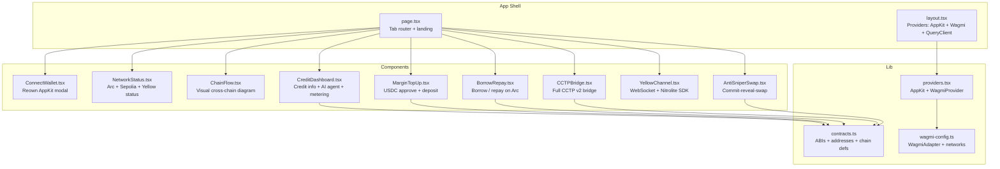

## Yellow Nitrolite Integration

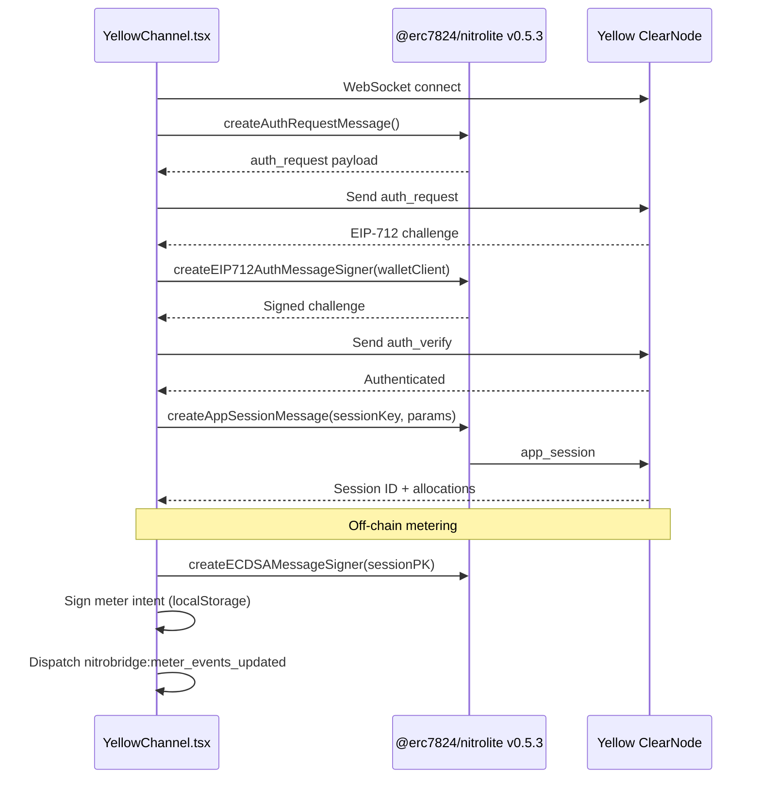

## Circle CCTP v2 Bridge

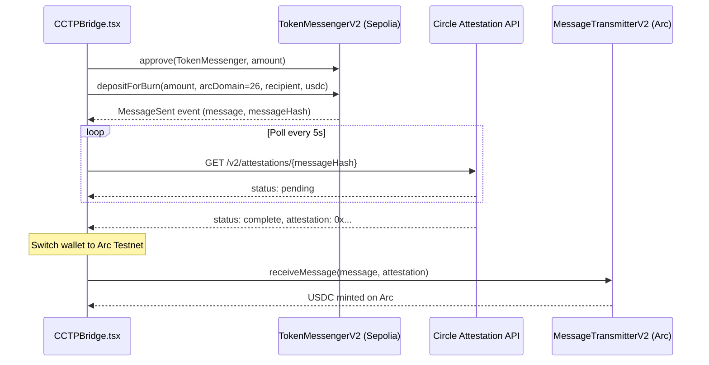

## AI Risk Agent

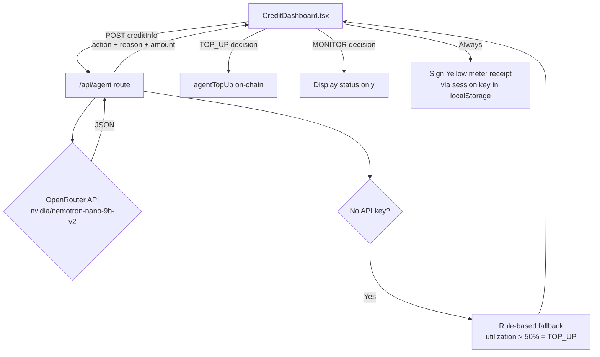

**Request:**
```json
{
  "userAddress": "0x...",
  "creditInfo": {
    "deposited": "10000000",
    "borrowed": "7000000",
    "creditLimit": "10000000",
    "available": "3000000"
  }
}
```

**Response:**
```json
{
  "action": "TOP_UP",
  "reason": "Utilization is 70%, exceeding safety threshold.",
  "amount": "100"
}
```

## Data Flow

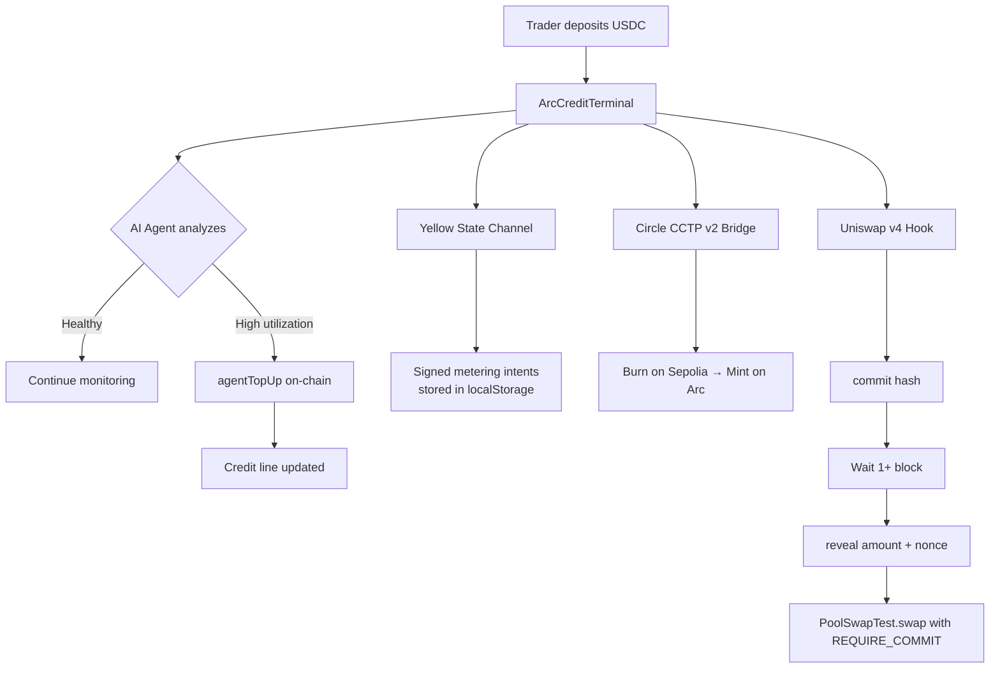

## Technology Stack

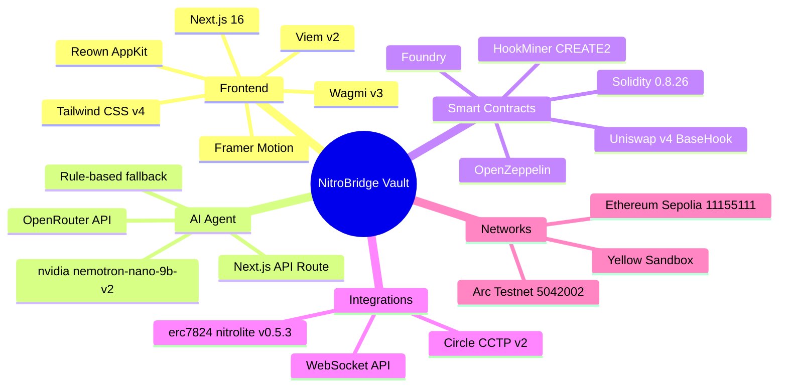

## Security Model

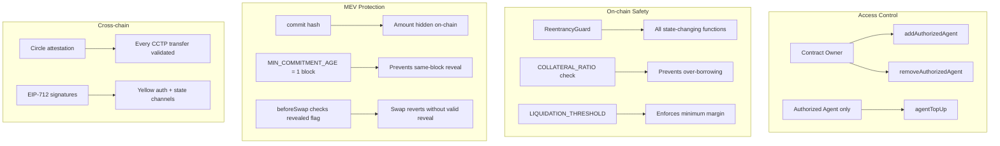

## Environment Variables

| Variable | Required | Description |
|----------|----------|-------------|
| `NEXT_PUBLIC_WALLETCONNECT_PROJECT_ID` | Yes | WalletConnect / Reown project ID |
| `OPENROUTER_API_KEY` | No* | OpenRouter API key for LLM agent |

*Agent falls back to rule-based logic (>50% utilization = TOP_UP) if no key is set.

## Contract ABIs

All ABIs are embedded in `frontend/lib/contracts.ts` for zero-config deployment — no external ABI files or build steps needed.
