# NitroBridge Vault - Technical Architecture

> Deep technical documentation for the NitroBridge Vault system

## Deployed Infrastructure

| Component | Address | Network | Block |
|-----------|---------|---------|-------|
| **ArcCreditTerminal** | `0xd1835d13A9694F0E9329FfDE9b18936CE872aae5` | Arc Testnet | 25322657 |
| USDC Token | `0x3600000000000000000000000000000000000000` | Arc Testnet | Native |
| TokenMessenger | `0xb43db544E2c27092c107639Ad201b3dEfAbcF192` | Arc Testnet | Circle |
| MessageTransmitter | `0x8FE6B999Dc680CcFDD5Bf7EB0974218be2542DAA` | Arc Testnet | Circle |

## System Architecture

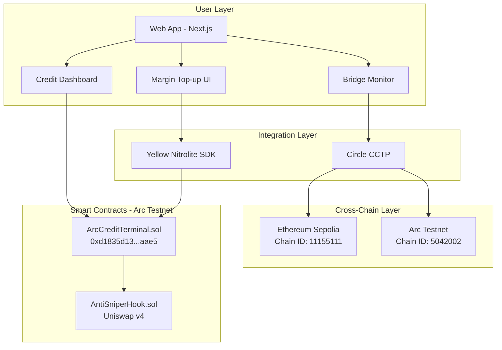

## End-to-End Flow

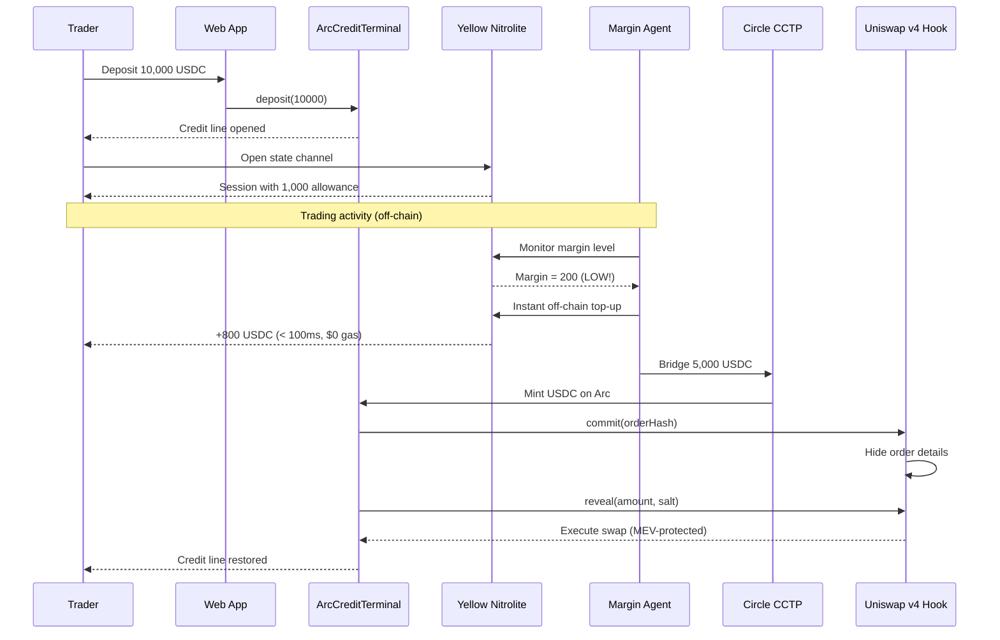

## Component Architecture

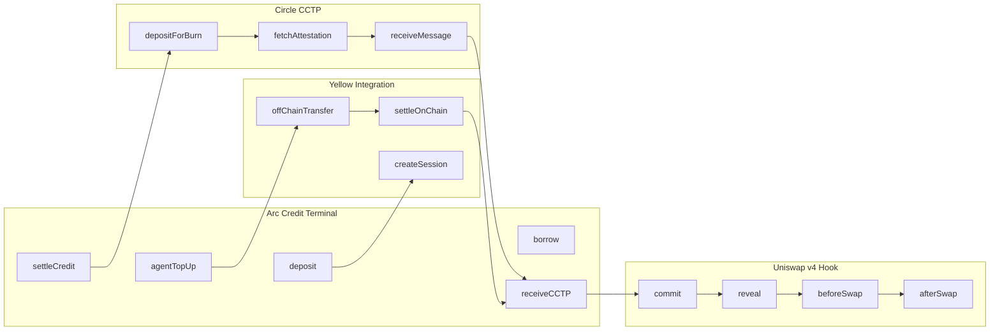

## Data Flow

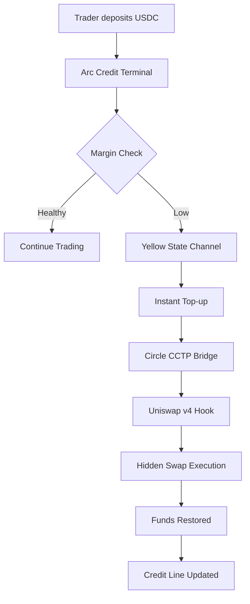

## Technology Stack

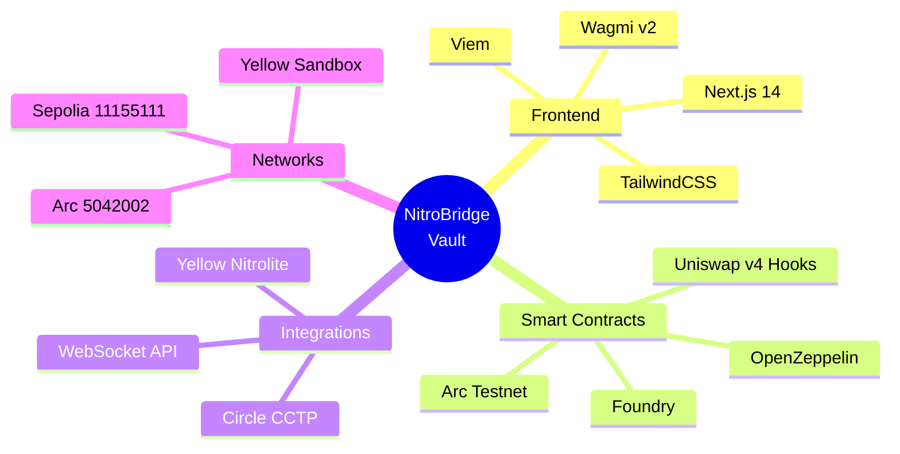

## Deployment Architecture

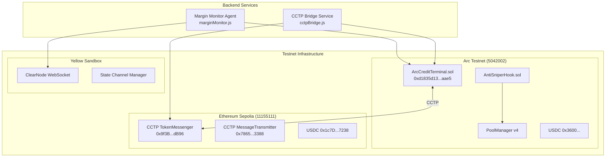

## Smart Contract Details

### ArcCreditTerminal.sol

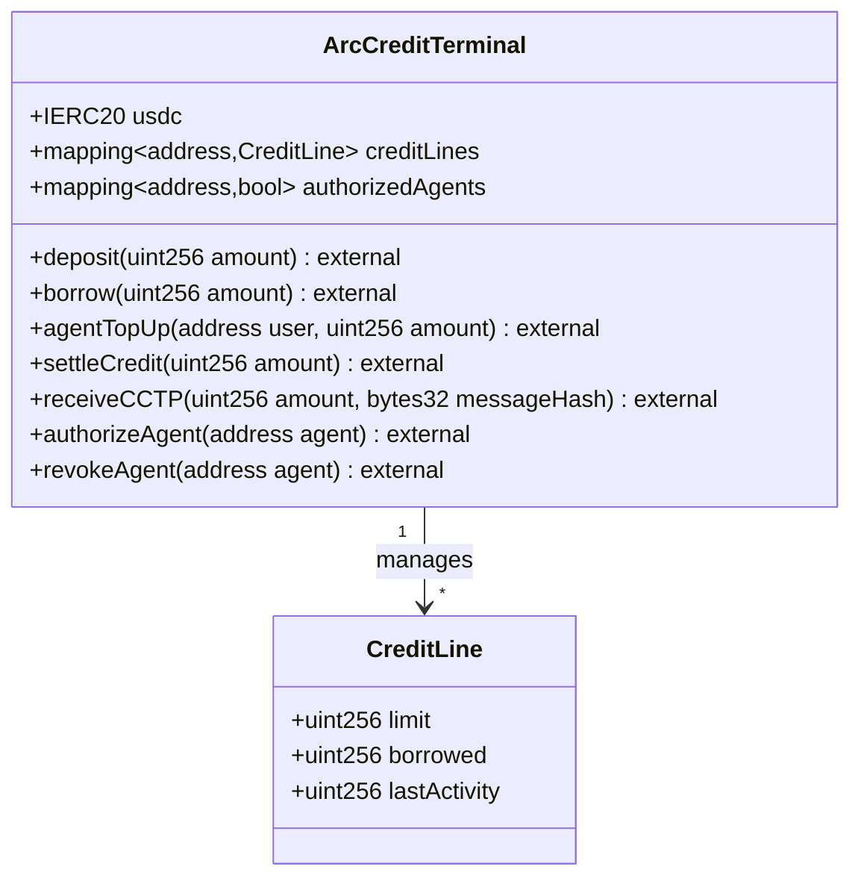

### AntiSniperHook.sol

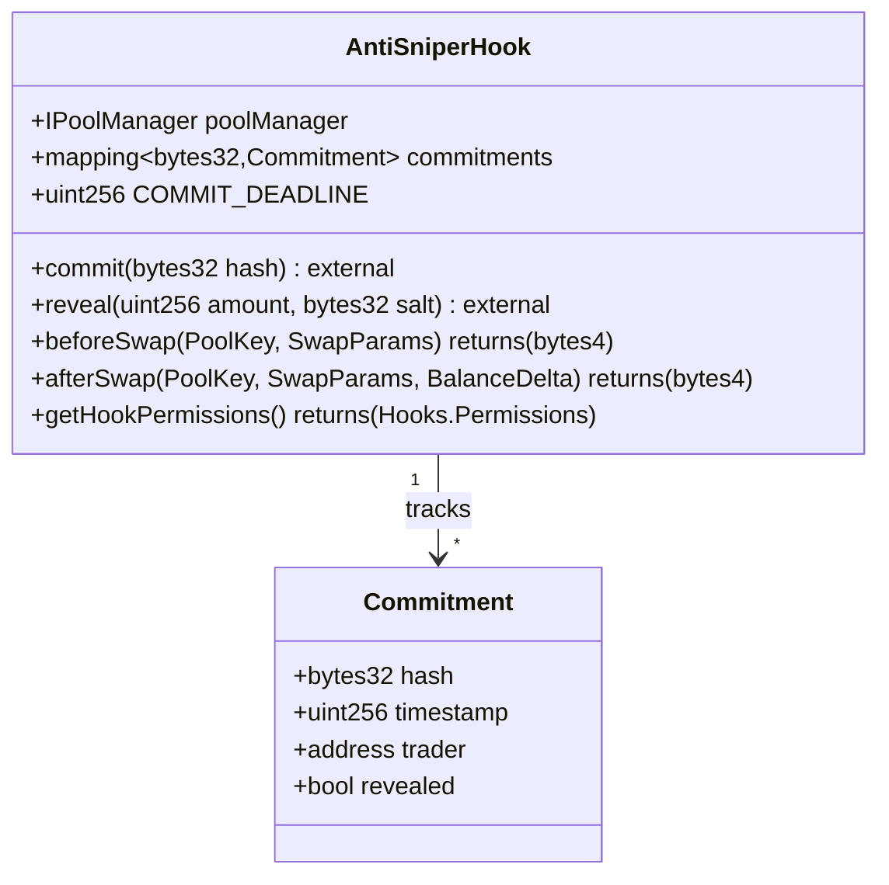

## Yellow Nitrolite Integration

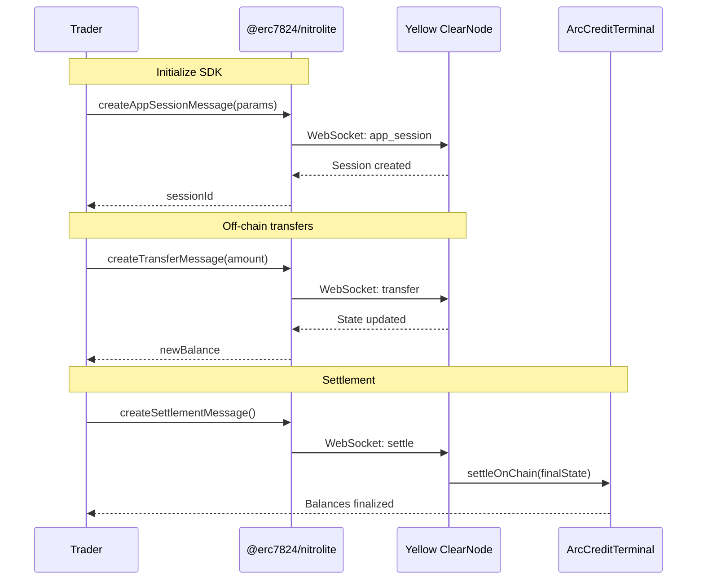

## Circle CCTP Integration

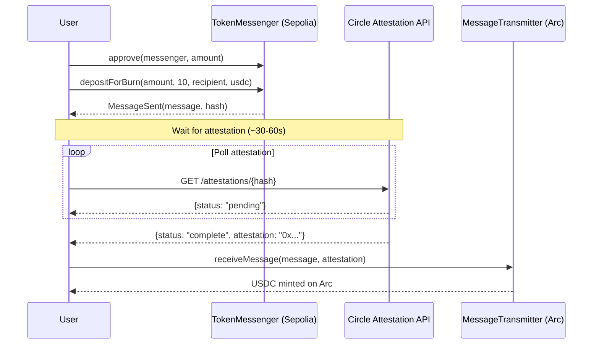

## Security Model

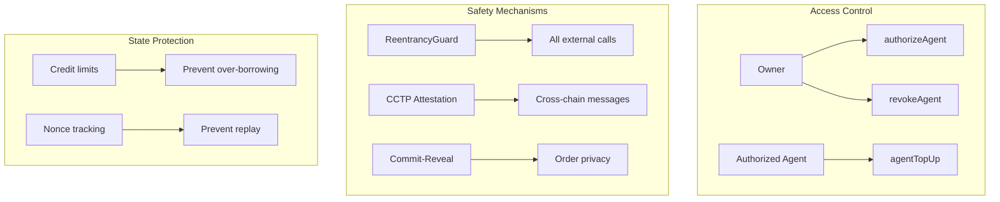

## API Reference

### Backend Services

| Service | File | Purpose |
|---------|------|---------|
| Margin Monitor | `marginMonitor.js` | Yellow SDK integration, margin monitoring, auto top-up |
| CCTP Bridge | `cctpBridge.js` | Cross-chain USDC bridging via Circle CCTP |

### Environment Variables

| Variable | Required | Description |
|----------|----------|-------------|
| `PRIVATE_KEY` | Yes | Agent wallet private key |
| `ARC_RPC_URL` | Yes | Arc testnet RPC endpoint |
| `SEPOLIA_RPC_URL` | No | Sepolia RPC endpoint |
| `YELLOW_WS_URL` | No | Yellow ClearNode WebSocket URL |

### Contract ABIs

See `contracts/arc-credit/out/` for compiled ABIs after running `forge build`.

