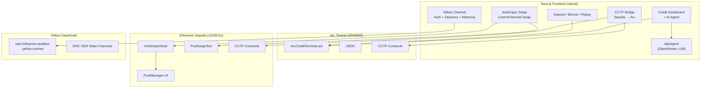

# NitroBridge Vault

> **Revolving credit line with instant cross-chain margin refills, MEV-protected swaps, and off-chain metering — all from the browser.**

**Live:** [nitrobridgedev.vercel.app](https://nitrobridgedev.vercel.app)

## The Problem

Traders with capital across multiple chains face catastrophic margin calls:

| Pain Point | Current Reality | Impact |
|------------|-----------------|--------|
| **Bridge Latency** | 5–15 min finality | Liquidated before funds arrive |
| **MEV Extraction** | Public refill signals | Bots frontrun, +2–5% slippage |
| **Fragmented Liquidity** | USDC on the wrong chain | Manual bridging, multiple gas tokens |
| **No Credit Memory** | Every tx starts fresh | Perfect repayers treated like new users |

## The Solution

NitroBridge Vault is a **fully client-side Next.js dApp** (no backend server) that combines:

- **Arc Testnet** — on-chain revolving credit (deposit, borrow, agent top-up)
- **Yellow Network** — off-chain state channels for instant metering & settlement via ERC-7824 Nitrolite SDK
- **Uniswap v4** — custom `AntiSniperHook` with commit-reveal MEV protection
- **Circle CCTP v2** — native USDC bridging between Ethereum Sepolia and Arc Testnet
- **AI Risk Agent** — LLM-powered credit analysis via a Next.js API route (`/api/agent`)

Everything runs in the browser (wagmi + viem) or in Next.js edge functions. There is no separate backend process.

## Architecture



## Deployed Contracts

| Contract | Network | Address | Explorer |
|----------|---------|---------|----------|
| **ArcCreditTerminal** | Arc Testnet | `0xd1835d13A9694F0E9329FfDE9b18936CE872aae5` | [View](https://testnet.arcscan.app/tx/0xf30bfc37a23013a8f68d2b5375f5f5b19ddc5934b889923d91ba91462b61970f) |
| **AntiSniperHook** | Eth Sepolia | `0x0A3b821941789AC5Ff334AB6C374bb23C98540c0` | [View](https://sepolia.etherscan.io/tx/0x3f495bb7d3b34ae58d1165bd1941083455afa28e89313463e13a10479247cebd) |
| ETH/USDC Pool (v4) | Eth Sepolia | Pool ID `0x825ea1...63e5` | [View](https://sepolia.etherscan.io/tx/0x77e97d786e38e1665c5cce44a8c3b24daffe953069d4497042f36ce1e4c182a3) |
| PoolManager (v4) | Eth Sepolia | `0xE03A1074c86CFeDd5C142C4F04F1a1536e203543` | Uniswap |
| PoolSwapTest (v4) | Eth Sepolia | `0x9B6b46e2c869aa39918Db7f52f5557FE577B6eEe` | Uniswap |
| USDC | Arc Testnet | `0x3600000000000000000000000000000000000000` | Native |
| TokenMessengerV2 | Eth Sepolia | `0x8FE6B999Dc680CcFDD5Bf7EB0974218be2542DAA` | Circle |
| TokenMessengerV2 | Arc Testnet | `0xb43db544E2c27092c107639Ad201b3dEfAbcF192` | Circle |
| MessageTransmitterV2 | Arc Testnet | `0xE737e5cEBEEBa77EFE34D4aa090756590b1CE275` | Circle |

## Project Structure

```
HackMoney2026/
├── frontend/                          # The entire running application
│   ├── app/
│   │   ├── layout.tsx                 # Root layout + Providers
│   │   ├── page.tsx                   # Landing page + tab navigation
│   │   ├── globals.css                # Tailwind + custom theme
│   │   └── api/agent/route.ts         # AI Risk Agent (OpenRouter LLM)
│   ├── components/
│   │   ├── CreditDashboard.tsx        # Arc credit info + AI agent + Yellow metering
│   │   ├── MarginTopUp.tsx            # Deposit USDC → credit line (Arc)
│   │   ├── BorrowRepay.tsx            # Borrow / repay on Arc
│   │   ├── CCTPBridge.tsx             # Full CCTP v2 bridge (Sepolia → Arc)
│   │   ├── YellowChannel.tsx          # Yellow ClearNode: auth, sessions, metering
│   │   ├── AntiSniperSwap.tsx         # Uniswap v4 commit-reveal-swap
│   │   ├── ConnectWallet.tsx          # Reown AppKit wallet connection
│   │   ├── NetworkStatus.tsx          # Multi-chain status indicator
│   │   └── ChainFlow.tsx             # Visual cross-chain diagram
│   ├── lib/
│   │   ├── contracts.ts               # All ABIs, addresses, chain definitions
│   │   ├── wagmi-config.ts            # Wagmi adapter + networks
│   │   └── providers.tsx              # AppKit + WagmiProvider + QueryProvider
│   └── package.json
│
├── contracts/
│   ├── arc-credit/
│   │   ├── src/ArcCreditTerminal.sol  # Revolving credit (OpenZeppelin)
│   │   └── script/Deploy.s.sol
│   └── uniswap-hook/
│       ├── src/AntiSniperHook.sol     # v4 hook: commit-reveal MEV protection
│       └── script/
│           ├── DeployHook.s.sol       # CREATE2 salt-mined deployment
│           └── CreatePool.s.sol       # Pool init with hook attached
│
├── backend/                           # Reference scripts (not used by frontend)
│   ├── marginMonitor.js               # Standalone agent example
│   └── cctpBridge.js                  # Standalone CCTP example
│
├── ARCHITECTURE.md
└── README.md
```

## Quick Start

```bash
git clone https://github.com/N-45div/HackMoney2026.git
cd HackMoney2026/frontend
npm install
npm run dev
# Open http://localhost:3000
```

### Environment Variables

Create `frontend/.env.local`:

```bash
# Required
NEXT_PUBLIC_WALLETCONNECT_PROJECT_ID=your_walletconnect_project_id

# Optional (AI agent uses rule-based fallback if missing)
OPENROUTER_API_KEY=your_openrouter_key
```

### Wallet Setup

1. **Add Arc Testnet to MetaMask**: Chain ID `5042002`, RPC `https://rpc.testnet.arc.network`
2. **Ethereum Sepolia**: Auto-configured by wallet providers

### Get Test Tokens

- **Sepolia USDC**: [faucet.circle.com](https://faucet.circle.com/)
- **Sepolia ETH**: [sepoliafaucet.com](https://sepoliafaucet.com/)
- **Arc USDC**: Bridge Sepolia USDC → Arc via the CCTP Bridge tab

## Features

| Tab | What It Does | Chain | Key Code |
|-----|-------------|-------|----------|
| **Dashboard** | Live credit info + AI Risk Agent analysis + Yellow metering receipts | Arc Testnet | `CreditDashboard.tsx` |
| **Deposit** | Deposit USDC → open revolving credit line (150% collateral ratio) | Arc Testnet | `MarginTopUp.tsx` |
| **Borrow / Repay** | Borrow against credit line or repay debt | Arc Testnet | `BorrowRepay.tsx` |
| **CCTP Bridge** | Full CCTP v2 flow: approve → burn → poll attestation → mint | Sepolia → Arc | `CCTPBridge.tsx` |
| **Yellow Channel** | WebSocket auth → EIP-712 challenge → session → metering intents | Yellow Sandbox | `YellowChannel.tsx` |
| **MEV Shield** | Commit hash → reveal → swap via PoolSwapTest + AntiSniperHook | Eth Sepolia | `AntiSniperSwap.tsx` |

## Tech Stack

| Layer | Technology |
|-------|-----------|
| **Framework** | Next.js 16 (App Router, Turbopack) |
| **Wallet** | Reown AppKit + wagmi v3 + viem v2 |
| **Styling** | Tailwind CSS v4 + Framer Motion |
| **State Channels** | `@erc7824/nitrolite` v0.5.3 (Yellow Network) |
| **Smart Contracts** | Solidity 0.8.26, Foundry, OpenZeppelin Contracts |
| **Uniswap** | v4-core, v4-periphery (BaseHook, HookMiner) |
| **Bridge** | Circle CCTP v2 (TokenMessengerV2 / MessageTransmitterV2) |
| **AI Agent** | OpenRouter → `nvidia/nemotron-nano-9b-v2:free` |
| **Deployment** | Vercel (frontend), Foundry (contracts) |

## Security

- **ReentrancyGuard** on all ArcCreditTerminal external functions (OpenZeppelin)
- **Agent authorization** — only whitelisted addresses can call `agentTopUp()`
- **Commit-reveal** — swap amounts hidden until execution block
- **EIP-712 signatures** — Yellow auth and state channel messages
- **CCTP attestation** — Circle validates every cross-chain USDC transfer

## Network Configuration

| Network | Chain ID | RPC | Explorer |
|---------|----------|-----|----------|
| Arc Testnet | 5042002 | `https://rpc.testnet.arc.network` | [arcscan.app](https://testnet.arcscan.app) |
| Ethereum Sepolia | 11155111 | Public | [sepolia.etherscan.io](https://sepolia.etherscan.io) |
| Yellow Sandbox | — | `wss://clearnet-sandbox.yellow.com/ws` | — |

---

**NitroBridge Vault** — *Because your margin shouldn't wait for finality.*
