# NitroBridge Vault

> **Instant cross-chain margin refills with sub-second state channel settlements and MEV-protected execution**

## The Problem

Traders with capital across multiple chains face catastrophic margin calls:

| Pain Point | Current Reality | Impact |
|------------|-----------------|--------|
| **Bridge Latency** | 5-15 minute finality | Position liquidated before funds arrive |
| **MEV Extraction** | Public refill signals | Bots frontrun, increasing costs 2-5% |
| **Fragmented Liquidity** | USDC on wrong chain | Manual bridging, multiple gas tokens |
| **No Credit Memory** | Every tx starts fresh | Perfect repayers treated like new users |

**A $50,000 margin call with 5-minute bridge time = guaranteed liquidation.**

## The Solution

NitroBridge Vault combines three breakthrough technologies:

```mermaid
graph TB
    subgraph "Integration Layer"
        Y[Yellow Nitrolite<br/>State Channels<br/>⚡ <100ms, Zero gas]
        C[Circle CCTP<br/>Native USDC Bridge<br/>🌉 Sepolia ↔ Arc]
        U[Uniswap v4 Hooks<br/>Commit-Reveal<br/>🔒 MEV Protection]
    end
    
    subgraph "Core Protocol"
        ACT[ArcCreditTerminal<br/>Revolving Credit<br/>Agent-Authorized<br/>Auto-Refill]
    end
    
    Y --> ACT
    C --> ACT
    U --> ACT
```



## Architecture Overview


## Transaction Flow


## Smart Contract Architecture


## Yellow State Channel Flow


## Circle CCTP Bridge Flow


## Component Integration


## Deployed Contracts

| Contract | Network | Address | Tx Hash |
|----------|---------|---------|---------|
| **ArcCreditTerminal** | Arc Testnet | `0xd1835d13A9694F0E9329FfDE9b18936CE872aae5` | `0xf30bfc37a23013a8f68d2b5375f5f5b19ddc5934b889923d91ba91462b61970f` |
| USDC | Arc Testnet | `0x3600000000000000000000000000000000000000` | Native |
| TokenMessenger | Arc Testnet | `0xb43db544E2c27092c107639Ad201b3dEfAbcF192` | Circle |
| MessageTransmitter | Arc Testnet | `0x8FE6B999Dc680CcFDD5Bf7EB0974218be2542DAA` | Circle |

## Project Structure

```
HackMoney2026/
├── contracts/
│   ├── arc-credit/
│   │   ├── src/
│   │   │   └── ArcCreditTerminal.sol      # Core credit line logic
│   │   ├── script/
│   │   │   └── Deploy.s.sol               # Deployment script
│   │   └── foundry.toml                   # Foundry config
│   │
│   └── uniswap-hook/
│       ├── src/
│       │   └── AntiSniperHook.sol         # MEV protection hook
│       └── script/
│           └── DeployHook.s.sol           # Hook deployment
│
├── backend/
│   ├── marginMonitor.js                   # Yellow SDK integration
│   ├── cctpBridge.js                      # Circle CCTP bridge
│   └── package.json
│
├── frontend/
│   ├── app/                               # Next.js app router
│   ├── components/
│   │   ├── CreditDashboard.tsx            # Credit line UI
│   │   ├── MarginTopUp.tsx                # Top-up interface
│   │   └── ConnectWallet.tsx              # Wallet connection
│   └── package.json
│
└── README.md
```

## Quick Start

```bash
# 1. Clone repository
git clone https://github.com/N-45div/HackMoney2026.git
cd HackMoney2026

# 2. Install backend dependencies
cd backend && npm install

# 3. Configure environment
cp .env.example .env
# Edit .env with your private key

# 4. Run margin monitor agent
npm start

# 5. In another terminal, start frontend
cd ../frontend && npm install && npm run dev
```

## Environment Variables

```bash
# Required
PRIVATE_KEY=0x...                    # Agent wallet private key
ARC_RPC_URL=https://rpc.testnet.arc.network

# Optional
SEPOLIA_RPC_URL=https://rpc.sepolia.org
YELLOW_WS_URL=wss://clearnet-sandbox.yellow.com/ws
```

## Network Configuration

| Network | Chain ID | RPC URL | Explorer |
|---------|----------|---------|----------|
| Arc Testnet | 5042002 | `https://rpc.testnet.arc.network` | [Explorer](https://explorer.testnet.arc.network) |
| Sepolia | 11155111 | `https://rpc.sepolia.org` | [Etherscan](https://sepolia.etherscan.io) |
| Yellow Sandbox | - | `wss://clearnet-sandbox.yellow.com/ws` | - |

## Technical Specifications

- **Settlement Time**: < 100ms (Yellow state channel) / 30-60s (CCTP bridge)
- **Gas Cost**: $0 for off-chain transfers / ~$0.04 for on-chain settlement
- **Supported Assets**: USDC (native via Circle CCTP)
- **Credit Limit**: Configurable per user (default: 100% of deposit)
- **Collateral Ratio**: 100% (fully collateralized credit line)

## Security Considerations

1. **State Channel Security**: All off-chain states are cryptographically signed
2. **CCTP Attestation**: Circle validates every cross-chain message
3. **Commit-Reveal**: Order details hidden until execution
4. **Agent Authorization**: Only whitelisted agents can trigger top-ups
5. **Reentrancy Protection**: All contracts use OpenZeppelin's ReentrancyGuard

---

**NitroBridge Vault** — *Because your margin shouldn't wait for finality.*
